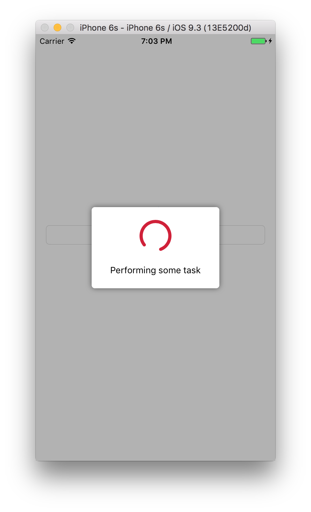

# Spinner

[](https://travis-ci.org/devnikor/Spinner)
[](http://cocoapods.org/pods/Spinner)
[](http://cocoapods.org/pods/Spinner)
[](http://cocoapods.org/pods/Spinner)



## Usage

1. Create instance of `Spinner`:

  `private let spinner = Spinner()`
  
2. Show `spinner`:

  `spinner.showInView(view, withTitle: text)`
  
3. Hide `spinner` when needed:

  ```swift
  spinner.hide()
  
  // or
  
  spinner.hide {
      // completion
  }
  ```

You can try this pod by using `pod try Spinner`

## Requirements

- Xcode 7.3
- iOS 9

## Installation

Spinner is available through [CocoaPods](http://cocoapods.org). To install
it, simply add the following line to your Podfile:

```ruby
pod "Spinner"
```

## Author

Igor Nikitin, devnickr@icloud.com

## License

Spinner is available under the MIT license. See the LICENSE file for more info.
